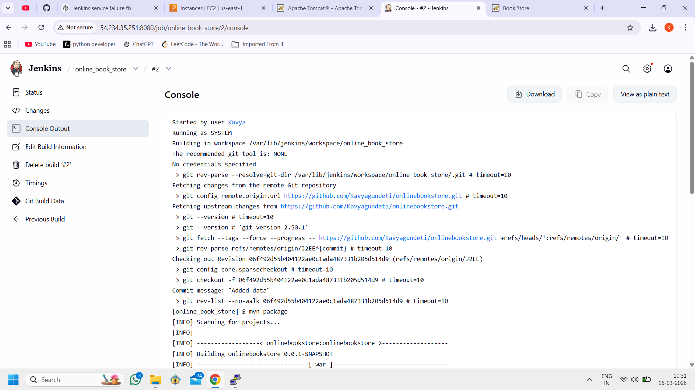
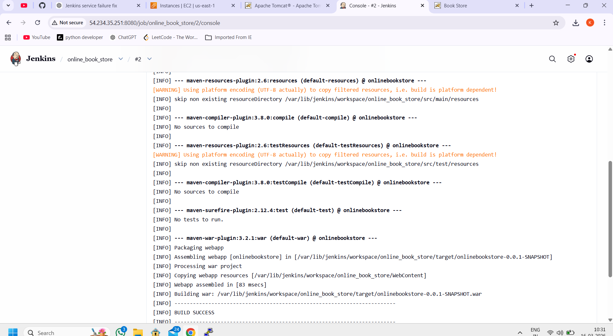
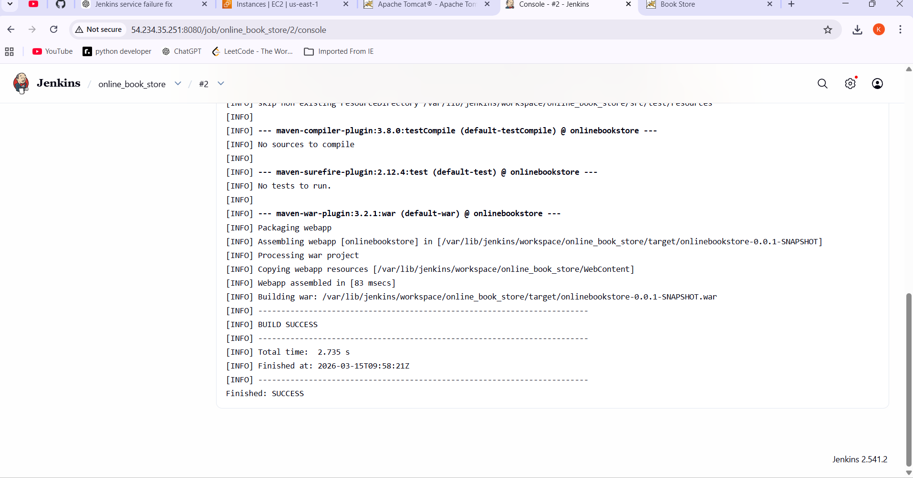

# 📚 Online Book Store – CI/CD Pipeline using Jenkins

## 🚀 Project Overview

The **Online Book Store** is a Java-based web application developed to demonstrate a **complete CI/CD pipeline using Jenkins, Maven, GitHub, and Apache Tomcat**.
This project showcases how modern **DevOps practices** automate the software development lifecycle — from code commit to build, packaging, and deployment.
The application allows users to browse available books, login as an admin or user, and manage book-related operations through a simple web interface.

---

## 🛠️ Tech Stack

| Technology | Purpose |
|-----------|--------|
| Java | Backend application development |
| JSP / Servlets | Web interface |
| Maven | Build automation and dependency management |
| Jenkins | Continuous Integration |
| Git | Version control |
| GitHub | Source code hosting |
| Apache Tomcat | Application server for deployment |
| AWS EC2 | Hosting Jenkins and Tomcat |

---

## 📂 Project Structure
```text
onlinebookstore-jenkins
│
├── pom.xml
├── .gitignore
├── Dummy_Database.md
├── web.txt
│
├── image1.png
├── image2.png
├── image3.png
├── login page.png
│
└── README.md
```

---

## ⚙️ CI/CD Workflow

This project demonstrates a **complete CI/CD pipeline**.
Developer → GitHub → Jenkins → Maven Build → WAR File → Tomcat Deployment → Live Application


### Pipeline Steps

1️⃣ Developer pushes code to **GitHub repository**

2️⃣ **Jenkins** automatically pulls the latest code

3️⃣ **Maven** compiles and builds the application

4️⃣ Jenkins generates the **WAR artifact**

5️⃣ The WAR file is deployed to **Apache Tomcat**

6️⃣ The application becomes accessible through the browser

---

## ⚙️ Build Process

Build the project using Maven:
`mvn clean package`
After a successful build, Maven generates the WAR file:
`target/onlinebookstore-0.0.1-SNAPSHOT.war` 


---

## 🚀 Deployment to Apache Tomcat

The generated WAR file is deployed into the **Tomcat webapps directory**.

Example:
`cp onlinebookstore-0.0.1-SNAPSHOT.war apache-tomcat/webapps/`

### Restart the Tomcat server:
` cd apache-tomcat/bin
./shutdown.sh
./startup.sh `


---

## 🌐 Application Access

Once deployed, open the application in the browser:
`http://<SERVER-IP>:8081/onlinebookstore-0.0.1-SNAPSHOT`
Example:
http://54.234.35.251:8081/onlinebookstore-0.0.1-SNAPSHOT


---

## 📸 Project Screenshots

### Jenkins Build Console Output



### Jenkins Build Success



### Application Running on Tomcat



### Online Book Store Login Page


---

## ⭐ Key Learning Outcomes

Through this project I gained practical experience with:

- Jenkins CI/CD pipeline setup
- GitHub integration with Jenkins
- Maven build automation
- Deploying Java applications on Apache Tomcat
- Managing build artifacts in Jenkins
- Hosting DevOps tools on AWS EC2

---

## 📦 GitHub Repository

Repository Link:
https://github.com/Kavyagundeti/onlinebookstore-jenkins


---

## 👩‍💻 Author

**Kavya Gundeti**

GitHub Profile:  
https://github.com/Kavyagundeti

---

## 📜 License

This project is created for **learning and demonstration of CI/CD pipelines using Jenkins**.
