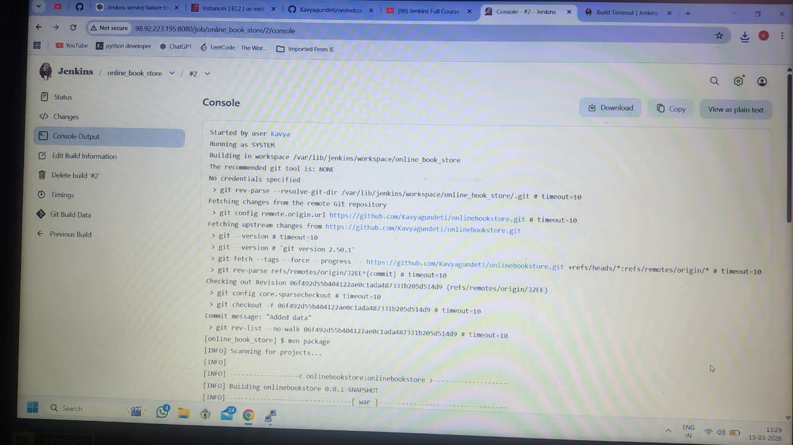
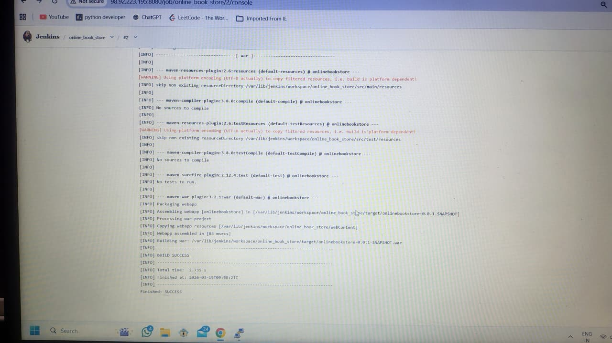
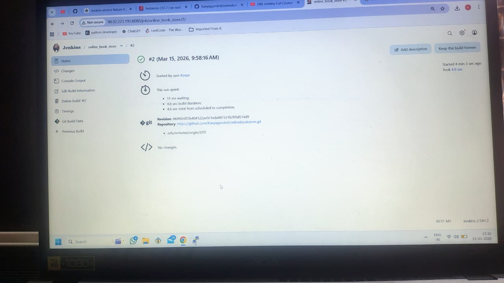

# 📚 Online Book Store – Jenkins CI/CD Project

## 🚀 Project Overview

The **Online Book Store** project is a Java-based web application that demonstrates how to build and automate a project using **CI/CD pipelines with Jenkins**.

This repository showcases how a Java application can be built, packaged, and managed using modern DevOps practices such as **GitHub version control, Maven build automation, and Jenkins continuous integration**.

---

## 🛠️ Tech Stack

| Technology     | Purpose                                      |
| -------------- | -------------------------------------------- |
| Java           | Application development                      |
| Maven          | Build automation                             |
| Jenkins        | Continuous Integration / Continuous Delivery |
| Git            | Version control                              |
| GitHub         | Code hosting                                 |
| JSP / Servlets | Web application interface                    |

---

## 📂 Project Structure

```
onlinebookstore-jenkins
│
├── pom.xml                # Maven build configuration
├── .gitignore             # Git ignore rules
├── Dummy_Database.md      # Database structure reference
├── web.txt                # Web configuration notes
│
├── image1.jpeg            # Jenkins build screenshot
├── image2.jpeg            # Jenkins pipeline output
├── image3.jpeg            # Application result screenshot
│
└── README.md              # Project documentation
```

---

## ⚙️ Build Process

The project uses **Apache Maven** for building the application.

### Build Command

```
mvn clean package
```

After building, Maven generates a **WAR file**:

```
target/onlinebookstore-0.0.1-SNAPSHOT.war
```

This file can be deployed to any Java application server such as **Tomcat**.

---

## 🔄 CI/CD Pipeline with Jenkins

This project is integrated with **Jenkins** to automate the build process.

### Pipeline Steps

1. Developer pushes code to **GitHub**
2. Jenkins pulls the latest code from the repository
3. Maven compiles the project
4. WAR package is generated
5. Build results are displayed in Jenkins console output

---

## 📸 Jenkins Build Screenshots

### Jenkins Build Console Output



### Jenkins Pipeline Execution



### Application / Build Result



---

## 📦 Repository

GitHub Repository:

https://github.com/Kavyagundeti/onlinebookstore-jenkins

---

## 👩‍💻 Author

**Kavya Gundeti**

GitHub Profile
https://github.com/Kavyagundeti

---

## 📜 License

This project is created for **learning and demonstration of CI/CD with Jenkins**.

---

## ⭐ Key Learning Outcomes

* Jenkins Job Creation
* Integrating GitHub with Jenkins
* Automating Maven builds
* Understanding CI/CD pipelines
* Managing Java web applications

---


